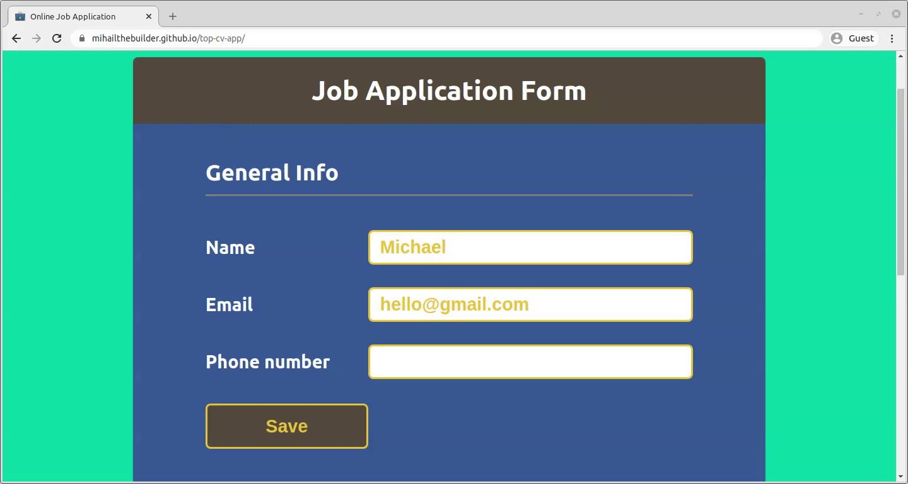
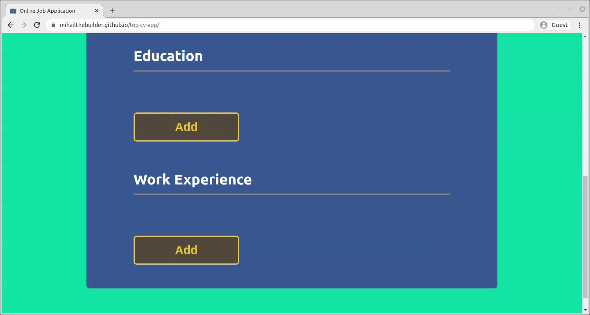
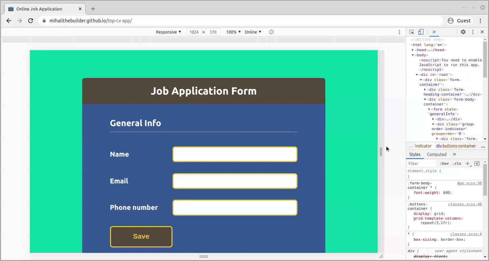

- [CV Application](#cv-application)
  - [Overview](#overview)
  - [How it works](#how-it-works)
    - [General Info](#general-info)
    - [Education](#education)
    - [Work Experience](#work-experience)
  - [Technical highlights](#technical-highlights)
    - [State configuration](#state-configuration)
    - [Component structure](#component-structure)
    - [State handlers](#state-handlers)
    - [Responsive design](#responsive-design)

# CV Application

## Overview

The React front-end of a job application form. [Click here](https://mihailthebuilder.github.io/top-cv-app/) for live demo.

**Update** I had another look at the project and I feel like the way I configure the states ([see here](#state-configuration)) is sub-optimal. It would've definitely been been better if I created separate states for each of the 3 sections. Maybe I should've even moved each of them into the corresponding components as well ([see here](#component-structure)). [This project](https://github.com/mihailthebuilder/personal-site) shows a better way to handle states across child components.

## How it works

The form has 3 sections...

### General Info

Has name, email and phone number inputs which you can save and edit.



### Education

Has school, course, start date and end date inputs. You can add new entries and save the information.



You can also edit and delete existing entries.


### Work Experience

Has employer, job title, main responsibilities, start date and end date inputs. You can perform the same actions as in the [Education](#education) section.

## Technical highlights

### State configuration

All of the information is managed from a single state called `formData` in [App.js](./src/App.js):

```js
const [formData, setFormData] = useState({
  /* generalInfo initialised with data because its input html 
    elements need to appear from the start. For the other 2 sections,
      the inputs are created when newEntry is triggered.
    */
  generalInfo: new AnswerObj([{ name: "", email: "", phone: "" }]),
  education: new AnswerObj(),
  jobs: new AnswerObj(),
});
```

`formData` has 3 keys, each corresponding to the 3 sections in the application form. Each key is initialised with an `AnswerObj` object, which also contains 3 keys:

- `answers` - an array of all the entries for a given section.
- `saved` - a Boolean that indicates whether section should be saved or made editable
- `newEntry` - a Boolean showing whether a new entry is being added

This configuration was one of the two key pieces that enabled me to develop state handling functions which can be applied for input changes across all 3 sections.

### Component structure

Having common state handling functions in [App.js](./src/App.js) also required me to think carefully about the structure of the components. The event listeners that triggered these functions had to figure out a way to distinguish between different states, entry groups (job #1 vs job #2) and inputs.

Here is a broad representation of the JSX rendered:

```jsx
//component that wraps the entire section. Same case for GeneralInfo and WorkExp
<Education>
  {/*this tells the state handling function which section we're looking at */}
  <form state="education">
    {/*grouporder points the entry (job #1, job #2, etc.) to the function*/}
    <div className="group-order-indicator" grouporder="0">
      {/*inputkey tells the function which input in that entry is being activated*/}
      <LineInput inputkey="school" />
      <LineInput inputkey="course" />
      {/*rest of code...*/}
    </div>
    <div className="group-order-indicator" grouporder="1">
      {/*same code as grouporder="0"*/}
    </div>
    {/*repeat div.group-order-indicator elements for all job entries*/}
  </form>
</Education>
```

### State handlers

Thanks to this component and state setup, I didn't need to develop different state handling functions for different sections, entries or inputs in the form. Here's an example of the function that controls any input changes:

```js
//triggered by the onChange attribute in any input
const inputChange = (event) => {
  //find the state, entry and input within the entry
  const stateKey = getStateAttr(event.target);
  const entryOrder = getEntryOrder(event.target);
  const inputKey = event.target.getAttribute("inputkey");

  //make a deep copy of the existing state object
  const newFormData = copyFormData(formData);

  //update the relevant input in the copied state object
  newFormData[stateKey].answers[entryOrder][inputKey] = event.target.value;

  //update the state
  setFormData(newFormData);
};
```

`copyFormData` from [index.js](./src/common/index.js) is a custom function made to deep copy of the `formData` object. This was needed because the object has an array and another object nested into it.

```js
const copyFormData = (obj) => {
  return Object.entries(obj).reduce((newObj, [stateObjKey, stateObjValue]) => {
    newObj[stateObjKey] = new AnswerObj(
      //the array of nested objects
      stateObjValue.answers.map((a) => Object.assign({}, a)),

      stateObjValue.saved,
      stateObjValue.newEntry
    );
    return newObj;
  }, {});
};
```

### Responsive design


