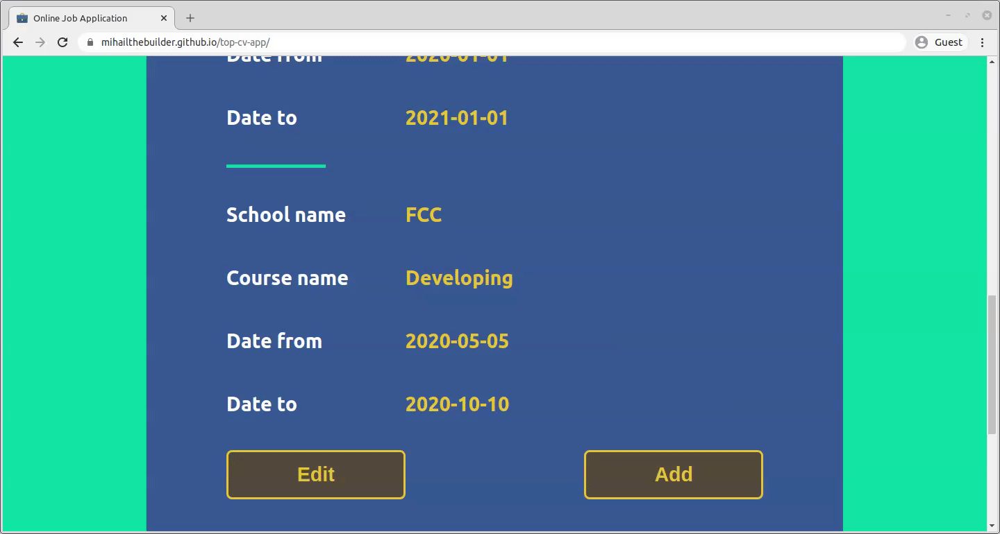

# CV Application

## Overview

The React front-end of a job application form. [Click here](https://mihailthebuilder.github.io/top-cv-app/) for live demo.

## How it works

The form has 3 sections...

### General Info

Has name, email and phone number inputs which you can save and edit.

### Education

Has school, course, start date and end date inputs. You can add new entries and save the information.

You can also edit and delete existing entries.

### Work Experience

Has employer, job title, main responsibilities, start date and end date inputs. You can perform the same actions as in the [Education](#education) section.

## Technical highlights

### State flow

Each section has a corresponding state. All states and corresponding handler functions are in `App.js`. Any state handler function can work with any of the 3 section states.

In order to achieve all the above, I needed to...

1. Come up with a generalised object that can capture data across all three states in the same structure. The solution is the AnswerObj object (see `src/common/index.jsx`), which holds 3 attributes:

- - `answers` - an array of all the entries for a given section.
- - `saved` - a Boolean that indicates whether section should be saved or made editable
- - `newEntry` - a Boolean showing whether a new entry is being added

2. Figure out a way to distinguish between different states, entry groups (job #1 vs job #2) and inputs. The solution involves rendering the inputs within the following html hierarchy:

- - a `form` element with a `state` attribute indicating the section
- - a `div` with class `group-order-indicator` which has the order of the entry in the `grouporder` attribute. This is needed to distinguish between different entries for the Education and Work Experience section
- - each `input` element has a `inputkey` attribute referencing the key of the input

### Other

Mobile & tablet responsive, with sizes (font, width, etc.) are generally split into...

- one for desktop of a fixed value in rem
- one for tablet/mobile that responds to the width of the screen (vw)

`src/common/common.scss` has variables that are used across all components, including...

- color combination
- screen size triggers for responsive behavior

`src/common/classes.scss` contains classes that are used across all components. These classes can be copied to other projects.
